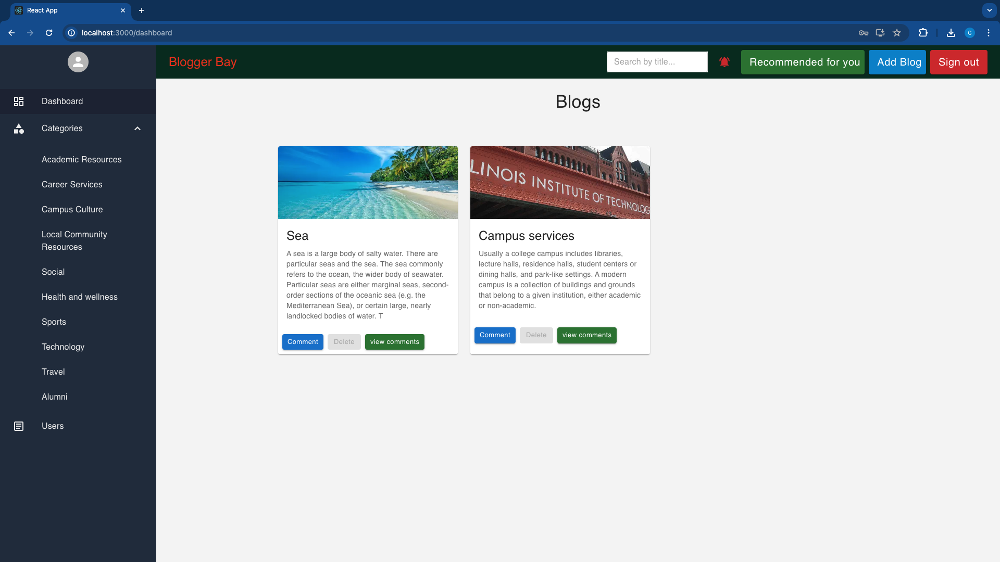

# Blogger-Bay
Blogger-Bay is a Blogging Platform for our school that allows users to create blogs. These posts can be categorized into different topics like Culture, Social, Sports, Technology, Campus life etc. To receive notifications about new posts, user can also subscribe to a category of posts. It will give recommendations for near by events and places using serp API. It will also provide weather details of the user's current location using Open Weather Map API. It will also generate comments using OpenAI API.

   </a>

### Steps to run this application on local machine (macOS)

    1. git clone https://github.com/godhapallavib/Blogger_Bay.git
    2. To run front end, go to bloggerbay-frontend folder and run "npm i" to install node modules and then run "npm run start" command
    3. To run back-end, go to bloggerbay-backend folder and run "npm i" to install node modules and then run "npm run start" command"
    4. To run elastic search go to bin folder of elastic search and run "./elasticsearch". Check if elastic search is running on http://localhost:9200/
    
    
    
(if it shows vulnerability or error run command)

    npm audit fix

The website will be running at localhost:3000

